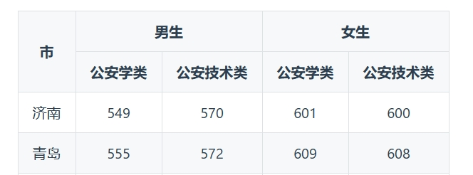

# goldmark-table
A table extension of [goldmark](http://github.com/yuin/goldmark) that allows rendering multiline table head, and support colspan and rowspan.


This is implemented basing on the [origin table extensionn code](https://github.com/yuin/goldmark/blob/master/extension/table.go).

# Usage
Just put the source file 'goldmark_table.go' into your project, and use it as goldmark extension:
```go
md := goldmark.New(
    goldmark.WithExtensions(utils.Table))
```
Markdown file for the example:
```makrdown
|2] 市    |2} 男生    |2} 女生   |
| 公安学类 | 公安技术类 | 公安学类 | 公安技术类 |
|:------:|:-------:|:------:|:------:|:------:|
| 济南   | 549   | 570  | 601   | 600 |
| 青岛   | 555   | 572  | 609   | 608 |
```
- |num}: colspan
- |num]: rowspan
- |num1}num2]: colspan and rowspan
